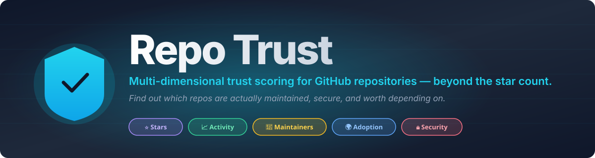
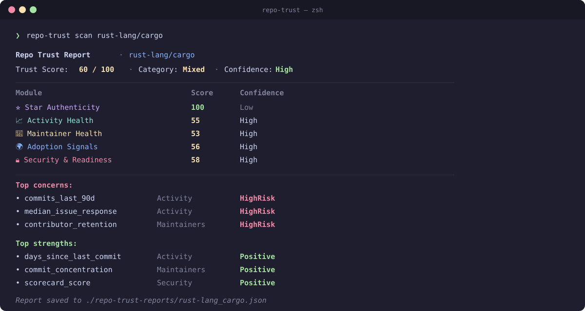

<div align="center">



[](https://github.com/Dmitrze/repo-trust/actions/workflows/ci.yml)
[](LICENSE)
[](docs/methodology.md)
[](https://www.rust-lang.org/)
[](CHANGELOG.md)
[](CONTRIBUTING.md)
[](https://scorecard.dev/viewer/?uri=github.com/Dmitrze/repo-trust)

[**Install**](#install) · [**Quick start**](#quick-start) · [**Methodology**](docs/methodology.md) · [**Sponsor**](#sponsorship)

<br>



</div>

---

## Why this exists

In 2024, researchers identified [**~6 million suspected fake stars across 18,617 GitHub repositories**](https://arxiv.org/pdf/2412.13459) — about **16% of repos with 50+ stars** showed fake-star campaign signals. Forks lag reality. "Last commit 2 days ago" tells you nothing about a one-person bus factor or a stale Scorecard.

GitHub stars are a popularity signal, not a trust signal — yet developers, scouts, and procurement teams use them as a shortcut for credibility every day.

Existing tools fix only part of the problem:

- **OpenSSF Scorecard** is excellent — but it scores *security*, not trust.
- **deps.dev** aggregates rich data — but is API-only, no opinion.
- **Snyk Advisor** and **Socket.dev** are SaaS-gated.
- **StarScout** is a research artifact, not a tool you can install.

**Repo Trust** is the missing diligence layer: a free, open-source, locally-runnable CLI that combines five trust dimensions into one explainable report.

---

## What it does

For any public GitHub repository, `repo-trust scan` produces a **Trust Score (0–100)** broken into five modules:

| Module | What it measures |
| --- | --- |
| ⭐ **Star Authenticity** | Are the popularity signals organic? Detects fake-star patterns using the StarScout 9-signal low-activity profile composite + lockstep timing z-score + ecosystem-aware fork/watcher ratios. |
| 📈 **Activity Health** | Is the repo alive? Commit cadence over 30/90/365-day windows, release rhythm, issue & PR latency, contributor activity. |
| 👥 **Maintainer Health** | Is stewardship sustainable? Bus-factor proxy, Gini coefficient on commits-by-author, contributor retention, governance docs. |
| 🌍 **Adoption Signals** | Is it actually used? Federates [deps.dev](https://deps.dev) for package presence + weekly downloads. Documentation maturity. |
| 🔒 **Security & Readiness** | Is it ready for production? Federates [OpenSSF Scorecard](https://scorecard.dev) (freshness-weighted) + OSV vulnerabilities + doc presence + CI workflows + semver discipline. |

Every score comes with **evidence**, a **confidence band** (Low / Medium / High), and **caveats** when data is partial. We never say *"this repo is fraud."* We say *"X% of sampled stargazers match a low-activity profile"* and let you draw the conclusion.

**Federation, not replication.** We *consume* OpenSSF Scorecard, deps.dev, OSV, and GitHub's APIs through thin ETag-aware clients with local SQLite caching. We do not duplicate what they do.

---

## Install

### From source (current)

```bash
cargo install --git https://github.com/Dmitrze/repo-trust --tag v0.1.0
```

Requires Rust 1.75+. Install Rust via [rustup.rs](https://rustup.rs/) if you don't have it.

### Coming with v0.1.x

- 📦 `cargo install repo-trust` from crates.io
- 🍺 Homebrew formula
- 🐳 Docker image (`ghcr.io/dmitrze/repo-trust`)
- 📥 Standalone binaries for Linux x86_64/arm64, macOS arm64, Windows x86_64

Released binaries ship with SLSA provenance and Sigstore keyless signatures — see [docs/RELEASE_VERIFICATION.md](docs/RELEASE_VERIFICATION.md) for verification steps.

### Recommended setup

```bash
# Set a GitHub token for higher rate limits (5000/hr instead of 60/hr)
# Create one at: https://github.com/settings/tokens (scope: public_repo)
export GITHUB_TOKEN=ghp_...
```

---

## Quick start

### Scan one repo

```bash
# Default standard mode — 5 modules, ~30s, ~200 API calls
repo-trust scan rust-lang/cargo

# Quick mode — headline signals only, <5s, ~30 API calls
repo-trust scan rust-lang/cargo --mode quick

# Deep mode — full stargazer sampling, <5min, ~2000 API calls
repo-trust scan rust-lang/cargo --mode deep
```

### Output formats

```bash
repo-trust scan rust-lang/cargo --format json | jq          # for scripting
repo-trust scan rust-lang/cargo --format md > report.md     # for PRs / docs
repo-trust scan rust-lang/cargo --format csv >> batch.csv   # for spreadsheets
repo-trust scan rust-lang/cargo --format json,md,csv        # multiple at once
```

### Selective modules

```bash
repo-trust scan rust-lang/cargo --modules security,maintainers
repo-trust scan rust-lang/cargo --skip-modules stars
```

### Local web viewer

```bash
repo-trust serve
# → open http://localhost:8765
```

### Cache management

```bash
repo-trust cache info              # cache location, size, row counts
repo-trust cache prune             # remove expired entries
repo-trust cache clear --all       # full reset
```

---

## Use cases

### 🔍 Picking between alternatives

You're choosing between three HTTP client libraries. Run `repo-trust scan` on each — compare maintainer concentration, adoption signal, security posture side-by-side. Decide with data instead of GitHub-stars vibes.

### 🛡 Security / procurement review

You're reviewing the dependency graph of a company project. Use `repo-trust scan` against each top-level dep. The deterministic JSON output is auditable and reproducible — paste it directly into a vendor-review checklist.

### 📈 As a maintainer

Score your own repo. The per-module breakdown tells you exactly which axes are weak — solo maintainer? Missing CODEOWNERS? Stale Scorecard? — and what's strong. Improvements are concrete and actionable.

---

## How it's different

### vs OpenSSF Scorecard

OpenSSF Scorecard answers: *"Does this project follow security best practices?"*
Repo Trust answers: *"Should I trust this repository — across all dimensions?"*

| Question | Scorecard | Repo Trust |
| --- | --- | --- |
| Is the repo actively maintained? | ✅ | ✅ |
| Are there CI workflows and signed releases? | ✅ | ✅ (federates Scorecard) |
| Does it have unfixed vulnerabilities? | ✅ | ✅ (federates OSV) |
| **Are the stars organic?** | ❌ | ✅ Star Authenticity |
| **Is one maintainer doing 90% of the work?** | ❌ | ✅ Maintainer Health |
| **Is the project actually adopted in the wild?** | ❌ | ✅ Adoption Signals |
| **What's the overall trust signal?** | ❌ (security only) | ✅ Weighted composite |

We **federate** Scorecard rather than replicate it. Scorecard's score contributes ~50% of our Security & Readiness module when fresh. If you only need security, run Scorecard. If you need trust, run us.

### vs Snyk Advisor / Socket.dev

- **Open source.** Apache-2.0. No paid tier.
- **CLI-first.** No SaaS account required.
- **Local-first.** No telemetry.
- **Explainable.** Every score has evidence and a confidence band.
- **Reproducible.** Same inputs + scoring version → byte-identical JSON.
- **Versioned methodology.** Scoring changes are SemVer-tracked.

---

## Methodology highlights

Read the full methodology in [`docs/methodology.md`](docs/methodology.md) (CC-BY-4.0 — citable, adaptable). Key principles:

- **No black-box ML in v1.** Scoring is a transparent weighted-evidence model with documented thresholds.
- **Confidence is independent of score.** A high-score-low-confidence repo is presented differently than a high-score-high-confidence repo.
- **Federate, don't replicate.** We import OpenSSF Scorecard, deps.dev, and OSV outputs as inputs, never duplicate them.
- **Conservative by design.** When data is partial, we report lower confidence. False positives on the fake-star flag are treated as worse than false negatives — real maintainers shouldn't be smeared by software.
- **Deterministic output.** Same input bytes ⇒ same output bytes (modulo `snapshot_at` and `runtime_seconds`). Enforced by snapshot tests + property tests. See [ADR-0007](docs/adr/0007-deterministic-output.md).

---

## Documentation

| Document | What it covers |
| --- | --- |
| [`docs/PRD.md`](docs/PRD.md) | Product Requirements — scope, goals, modules, roadmap |
| [`docs/architecture.md`](docs/architecture.md) | Architecture — modules, data flow, technology choices |
| [`docs/methodology.md`](docs/methodology.md) | Public methodology — what we measure and how (CC-BY-4.0) |
| [`docs/scoring-model.md`](docs/scoring-model.md) | Versioned scoring weights, thresholds, change log |
| [`docs/module-specs.md`](docs/module-specs.md) | Per-module input/output contracts |
| [`docs/benchmark-plan.md`](docs/benchmark-plan.md) | How we benchmark and validate scoring |
| [`docs/api-notes.md`](docs/api-notes.md) | GitHub API quirks, rate-limit notes |
| [`docs/governance.md`](docs/governance.md) | Project governance |
| [`docs/adr/`](docs/adr/) | 12 Architecture Decision Records |

---

## Project status

**v0.1.0** — alpha release. All five modules ship end-to-end. 274 tests (unit + integration + snapshot + property). Strict CI gates: clippy::pedantic, cargo-deny, cargo-audit, tarpaulin coverage ≥75%, rustdoc -D warnings. APIs and outputs may change before `v1.0.0` — pin a version when integrating.

See [the roadmap](docs/PRD.md#12-roadmap) for what's next: Python/Java/Ruby ecosystem support, deep-mode improvements, GitLab adapter, `--exit-code-on-category` for CI policy gates.

---

## Contributing

Contributions are very welcome. The fastest ways to make a difference:

1. **Try it on your favorite repos** and file issues where the score feels off — real-world feedback shapes calibration.
2. **Curate the benchmark set** in [`examples/benchmark-set.csv`](examples/benchmark-set.csv) — propose repos for the trust categories.
3. **Add module signals** — extend [`docs/module-specs.md`](docs/module-specs.md) with edge cases.
4. **Translate the methodology** — `docs/methodology.md` is CC-BY-4.0; translations are welcome.

Read [`CONTRIBUTING.md`](CONTRIBUTING.md) and [`CODE_OF_CONDUCT.md`](CODE_OF_CONDUCT.md) before opening a PR. We follow [Conventional Commits](https://www.conventionalcommits.org/).

Watch for issues labeled [`good first issue`](https://github.com/Dmitrze/repo-trust/issues?q=is%3Aopen+label%3A%22good+first+issue%22) — accessible entry points for first-time contributors.

---

## Sponsorship

Repo Trust is and will remain free, Apache-2.0, and self-hostable forever. **No paid tier. No SaaS gating. No telemetry.** There will never be a "Repo Trust Pro."

It is built and maintained by an independent developer. Sustainability depends on sponsorship.

[](https://github.com/sponsors/Dmitrze)

### For funds & grants

Repo Trust is a strong fit for several open-source funding programs:

- 💖 [GitHub Secure Open Source Fund](https://github.blog/security/github-secure-open-source-fund/) — supply-chain security tooling
- 🇪🇺 [Sovereign Tech Fund](https://www.sovereign.tech/) — critical OSS infrastructure (Germany)
- 🌍 [NLnet Foundation](https://nlnet.nl/) — Next Generation Internet themes (EU)
- 🦊 [Mozilla MOSS](https://www.mozilla.org/en-US/moss/) — security + privacy tooling
- 🔬 [Chan Zuckerberg Initiative EOSS](https://chanzuckerberg.com/eoss/) — essential open-source software

The methodology document is CC-BY-4.0, suitable for academic citation and grant work.

---

## Acknowledgements

Repo Trust stands on the shoulders of:

- The **OpenSSF Scorecard** team for setting the standard on open security health metrics.
- **Google Open Source Insights / deps.dev** for the public package-and-repo metadata graph.
- **OSV.dev** for the open vulnerability database.
- The **StarScout** authors (He et al., ICSE 2026) for the rigorous fake-star detection methodology that informs our Star Authenticity module.
- The **Dagster** team for [the original 2023 fake-star investigation](https://dagster.io/blog/fake-stars) and for open-sourcing [`fake-star-detector`](https://github.com/dagster-io/fake-star-detector).

If you publish research on repository trust, signal, or supply-chain integrity and we cite or build on your work, please tell us — we'll add proper attribution.

---

## Disclaimer

`repo-trust` produces a probabilistic signal designed to assist human judgment. It is **not** a security audit, legal advice, or a substitute for due diligence. Categories like `HighRisk` reflect score thresholds against documented heuristics, not allegations of misconduct. False positives can occur — please report them via [GitHub Issues](https://github.com/Dmitrze/repo-trust/issues).

---

## License

- **Code:** [Apache License 2.0](LICENSE) © 2026 Repo Trust contributors
- **Methodology** (`docs/methodology.md`): additionally [CC-BY-4.0](https://creativecommons.org/licenses/by/4.0/) — citable and adaptable

---

## Maintainer

Built and maintained by **Dmitry Melnik** ([@Dmitrze](https://github.com/Dmitrze)).

[**dmitrymelnik.ai**](https://dmitrymelnik.ai) — links to all channels (X, LinkedIn, contact).

---

<div align="center">

**Trust over hype.** **Explanations over scores.** **Free and open, forever.**

⭐ **[Star this repo](https://github.com/Dmitrze/repo-trust)** if you find it useful — it genuinely helps with discoverability.

</div>
